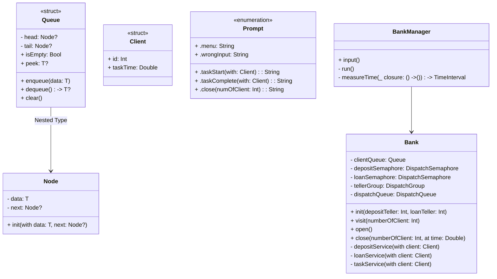

> 은행창구 관리 앱

### 개요

은행원이 3명 (예금 2명, 대출 1명)이라 가정하고,

고객의 업무(예금 또는 대출)을 소요 시간(0.7초 또는 1.1초)동안 처리한다.

각 업무 처리는 동시적으로 일어나야 한다.

### **🙋 팀원**
|  |  |
| ------------------------------------------------------------------------------------------------------------- | ---------------------------------------------------------------- |
| @JinUng41 | @KSK9820 |


## BankManagerConsoleApp

### 📂 디렉터리 구조

```
.
├── BankManager.swift
├── BankManagerConsoleApp
│   ├── BankManagerConsoleApp
│   │   ├── Data Structure
│   │   │   └── Queue.swift
│   │   ├── Model
│   │   │   ├── Bank.swift
│   │   │   ├── Client.swift
│   │   │   ├── Prompt.swift
│   │   │   └── TaskType.swift
│   │   └── main.swift
```

### 📍 클래스 다이어그램



### 📌 모델 구현 내용

| 이름 | 타입 | 구현 내용 |
| --- | --- | --- |
| Queue.swift | struct | client를 저장할 타입, 추상형 자료 구조인 큐를 구현함. |
| Bank.swift | final class | 은행의 시작, 업무 수행, 종료 등의 전반적인 은행 업무를 처리하는 모델 로직, 은행 업무를 비동기 처리함 |
| Client.swift | struct | client의 id, taskType(대출, 예금)을 프로퍼티로 가짐. |
| TaskType.swift | enum | 대출, 예금의 소요 시간과 이름을 분류함. |
| Prompt.swift | enum | 은행 메세지, 입력에 대한 메세지를 분류함. |
| BankManager.swift | struct | 은행의 시작, 종료와 타이머를 동작시킴. |
| main.swift | - | BankManager의 menu함수를 호출하여 프로그램을 실행시킴. |

### ⭐ 핵심 구현 내용

- LinkedList를 이용한 Queue 구현
    - 은행의 고객의 대기열을 사용할 Queue
    - Enqueue, Dequeue, Clear, Peek, isEmpty
    - 제네릭 타입을 적용
- 비동기를 이해하고 동시성 프로그래밍을 구현
    - GCD의 개념을 이해하기
    - sync와 async의 차이
    - Thread 개념 이해하기

## BankManagerUIApp

### 📂 디렉터리 구조

```
.
├── BankManager.swift
├── BankManagerUIApp
│   ├── BankManagerUIApp
│   │   ├── AppDelegate.swift
│   │   ├── Info.plist
│   │   ├── SceneDelegate.swift
│   │   ├── UIComponentsExtension.swift
│   │   └── ViewController.swift
│   ├── DataStructure
│   │   └── Queue.swift
│   ├── Model
│   │   ├── Bank.swift
│   │   ├── Client.swift
│   │   ├── ClientLabel.swift
│   │   ├── Prompt.swift
│   │   └── TaskType.swift
│   └── View
│       └── BankView.swift
```

### 📌 모델 구현 내용

| 이름 | 타입 | 역할 |
| --- | --- | --- |
| ViewController | final class | 각 버튼에 대한 메서드를 정의함, 타이머를 동작시킴과 동시에 비동기 작업을 실행시킴, 화면에서 label(고객 id, taskType)에 따른 레이블을 추가, 삭제하는 프로토콜을 구현함. |
| BankView | final class | Code로 구현된 커스텀 뷰로써, 뷰에 필요한 UI 요소와 오토레이아웃을 구현 |
| ClientLabel | final class | 고객에 대한 레이블 생성을 위해, 커스텀 레이블을 구현 |
| Bank | final class | 전반적인 은행 업무를 담당함, ViewController에서 이벤트가 발생하면, 해당 이벤트를 처리하는 로직을 구현함, 은행원이 업무를 비동기적으로 처리하는 작업이 실제로 실행됨, 또한 ViewController에 구현된 Label 프로토콜을 채택하여, UI 업데이트가 되도록 하였음. |
| Client | struct | 손님 객체로, id와 taskType(업무타입: 대출, 예금)을 프로퍼티로 가짐. |
| TaskType | enum | 업무의 종류(대출, 예금)과 그에 맞는 소요 시간과 description을 가짐. |
| Prompt | enum | 은행 메세지, 입력에 대한 메세지, 업무 상태에 대한 메세지 출력을 위함. |
- UIApp에서는 특별히 BankManager를 사용하지 않았음.

### ⭐ 핵심 구현 내용

- Console 기반의 앱을 활용하여 UIApp을 구현
- 커스텀 뷰를 구현하기
    - CodeUI로 구성
    - 오토레이아웃을 코드로 구현
- Dynamic StackView 구현
    - 스택뷰의 요소가 늘어남에 따라 스크롤이 가능하도록 UIScrollView를 사용
- 비동기 프로그램 중 UI 업데이트 구현
    - UI 업데이트는 Main 스레드에서 이루어져야 한다.


### 동작화면
실행하고 멈추었다가 실행하기 | 실행중에 인원추가하기 | 실행중에 초기화 누르고 다시 실행하기
------------------|---------------------|--------------------------
 |  | 

---

# 🫥 Trouble Shooting

[은행 창구 관리 앱 [STEP 1] bello, dora by JinUng41 · Pull Request #33 · tasty-code/ios-bank-manager](https://github.com/tasty-code/ios-bank-manager/pull/33)

[은행창구 관리 앱 [STEP 2] bello, dora by KSK9820 · Pull Request #38 · tasty-code/ios-bank-manager](https://github.com/tasty-code/ios-bank-manager/pull/38)

[은행창구 관리 앱 [STEP 3] bello, dora  by JinUng41 · Pull Request #47 · tasty-code/ios-bank-manager](https://github.com/tasty-code/ios-bank-manager/pull/47)

[은행창구 관리 앱 [STEP 4] bello, dora by JinUng41 · Pull Request #54 · tasty-code/ios-bank-manager](https://github.com/tasty-code/ios-bank-manager/pull/54)

## Queue 타입 구현

- 배열로써 큐를 구현하는 것이 아닌 연결리스트로서 Queue 타입을 구현해야 했습니다.
- 연결리스트는 노드를 단위로 합니다.
    - 노드에는 데이터와 다음 노드를 가리키는 참조값(주소)로 구성됩니다.
    - 노드가 다음 노드를 아무것도 가리키지 않으면 해당 노드는 연결 리스트의 끝을 의미합니다.
- 따라서 연결리스트에 사용되는 노드를 Class로 구현하였습니다.
    - 노드 내에서는 데이터와 다음 노드를 가리키는 주소를 가지도록 하였습니다.
    - 주소를 저장할 때는 옵셔널 타입을 사용하여, 연결 리스트의 끝을 의미할 때는 해당 속성이 `nil`을 가지도록 하였습니다.
- Queue 구조체에서는 기본적으로 다음의 메서드를 구현할 수 있었습니다.
    - Enqueue, Dequeue, Peek, Clear, isEmpty
- 추가적으로 Queue에서는 head와 tail을 두어, Enqueue 하는 과정에서 시간복잡도가 O(1)이 될 수 있도록 하였습니다.

## 은행원 3명의 구현 - 세마포어

- 은행원은 예금 2명, 대출 1명으로 총 3명의 은행원이 동시에 처리할 수 있는 업무는 예금 업무 2개, 대출 업무 1개입니다.
- 은행원들이 업무를 처리하는 시간은 정해져 있기 때문에 그 시간 동안은 다른 업무를 처리할 수 없습니다.
    - 이를 위해 예금 세마포어, 대출 세마포어를 사용하여 업무를 처리하는 함수에 들어올 수 있는 스레드의 수를 예금 업무 2개, 대출 업무 1개로 제한합니다.
- 대기 큐에 대출이 여러 개 있어도, 대출 업무를 담당하는 은행원은 1명이기 때문에 한 번에 처리할 수 있는 대출 업무는 1개로 순차적으로 업무를 처리합니다.

## 스레드를 단순히 많이 만드는 것과 정말 동작할 스레드 만을 만드는 것의 성능 차이

### 왜 이걸 생각하게 됐을까..

- 콘솔 앱을 구현해보면서, dequeue되는 고객들의 수만큼 스레드가 생기는데, semaphore로써 실행되는 스레드의 수를 제한을 걸게 되었습니다.
- 그러다가 단순히 스레드를 많이 만드는 것만으로도 성능에 어떠한 문제가 생길 수 있을까라는 생각을 가지게 되었고,
- WWDC의 영상을 참고하여 결론을 내릴 수 있었습니다.

### 결론은..

- 다음의 WWDC 영상을 보고 내용을 이해하였습니다.
    
    https://developer.apple.com/videos/play/wwdc2021/10254/
    
- 스레드는 실행해야 할 작업 이외에도 많은 정보를 가집니다. 또한 스레드를 관리하는 OS(커널)에서는 이러한 스레드를 관리하기 위한 정보를 가져야 합니다.
- 스레드가 기하급수적으로 늘어난다면 관리해야 하는 정보도 늘어나게 됩니다.
- 따라서 정보를 탐색하고 컨텍스트 스위칭하고 관리하는 스케줄링 과정에서 오버헤드가 발생할 수 있습니다.
    - 그렇게 되면 CPU의 효율성이 떨어져서 정상적인 성능을 내지 못하게 되는 문제가 발생하게 됩니다.

### 그래서..

- dequeue 되는 과정을 비동기 작업 내에서 세마포를 통해 제한을 두어, 스레드 자체가 3개가 생성되어 3개가 실행될 수 있도록 콘솔앱의 코드를 구현하였습니다.

## 업무의 비동기 할당 - GCD

- 고객 큐가 비어있지 않을 때까지 while문 내에서 고객(업무)를 은행원에게 배정합니다.
- 배정을 할 때, DispatchQueue.global().async로 새로운 스레드를 생성하면, CPU는 배당된 업무가 다 처리될 때까지 기다리지 않기 때문에 비동기적으로 업무를 할당할 수 있습니다.
- 업무는 비동기적으로 할당되었지만, 한 번에 처리할 수 있는 업무는 최대 3개(세마포어)입니다.
- STEP3에서는 DispatchGroup으로 DispatchQueue를 묶어주어 모든 업무가 끝날 때 메세지를 출력하고
- STEP4에서 역시 마찬가지이지만, UI업데이트를 위해 notify로 메인 스레드에게 모든 작업이 끝났음을 알립니다.

## UI 업데이트

- 업무를 수행하기 시작하면 화면의 ‘대기중’ 스택에서 ‘업무중’ 스택으로 고객 label을 옮기고(1), 업무를 끝마치면 ‘업무중’ 스택에서 label을 삭제(2)합니다.
- (1), (2)를 프로토콜로 작성하였으며, ViewController에서 채택하고 구현합니다.
- Bank에서 딜리게이트를 위임받아 업무를 시작하고 (1)을 호출하고, 업무가 끝나면 (2)를 호출하며 이는 모두 UI작업이기 때문에 main 스레드에서 작업합니다.
- 또한 업무를 처리하는 과정을 DispatchGroup으로 DispatchQueue들을 묶어주었기 때문에, 모든 업무가 끝나면 main 스레드에게 알려(group의 `notify()`) 타이머를 멈추게 할 수 있습니다.


